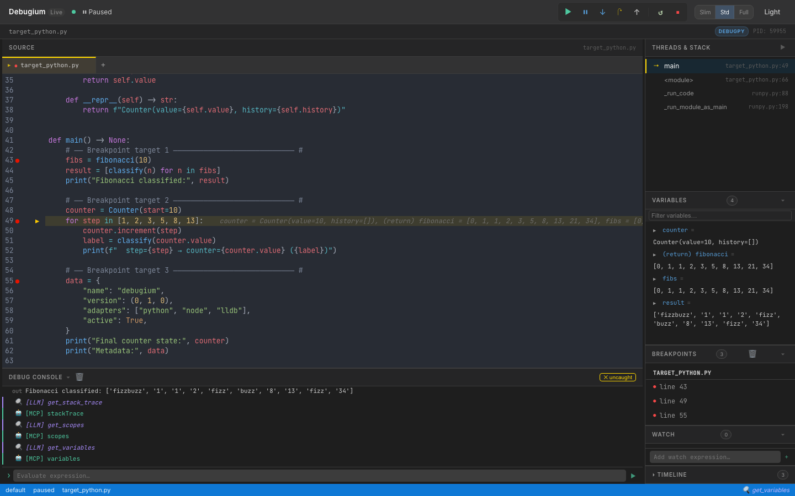

# Debugium

**A multi-language debugger with a real-time web UI and LLM integration via MCP.**

Debug Python, JavaScript, TypeScript, C, C++, Rust, Java, Scala, and WebAssembly programs from your browser — with AI-driven analysis through the [Model Context Protocol](https://modelcontextprotocol.io/).

[](https://github.com/Algiras/debugium/actions/workflows/ci.yml)
[](https://algiras.github.io/debugium)



---

## Features

### Web UI
- **Real-time web UI** — source viewer, breakpoints, variables (recursive expansion), call stack, console, timeline, watch expressions, findings — all updated live via WebSocket
- **Multi-tab source viewer** — open multiple files, click stack frames to navigate
- **Variable search** — filter variables by name with recursive expansion
- **Changed-variable highlighting** — variables that changed since last stop shown in orange
- **Thread selector** — switch between threads in multi-threaded programs
- **Panel collapse & resize** — drag to resize, toggle to collapse; Slim / Standard / Full layout presets
- **Dark / light mode** toggle
- **Auto-reconnect** — UI reconnects after a dropped WebSocket, with visual status indicator
- **Keyboard shortcuts** — F5 continue, F10 step over, F11 step in, Shift+F11 step out, Ctrl/Cmd+D dark mode
- **Button animations** — in-flight spinner and completion flash for debug commands

### Debugging
- **Multi-language** — Python (debugpy), Node.js/TypeScript (js-debug), C/C++/Rust (lldb-dap), Java (java-debug), Scala (Metals), WebAssembly (lldb-dap), or any DAP adapter via `dap.json`
- **Comprehensive DAP coverage** — 35+ DAP requests: breakpoints, stepping, goto, memory read/write, disassembly, and more
- **Breakpoints** — conditional, logpoints, hit-count, function, data (watchpoints), exception, run-to-cursor (`continue_until`)
- **Multi-session** — debug multiple programs simultaneously, with child session routing (js-debug)
- **Remote debugging** — attach to debugpy, JDWP, or Node inspector running on another machine or container

### LLM / MCP Integration
- **64 MCP tools** — the full debug session exposed to Claude or any LLM
- **Capability-gated tools** — tools automatically shown/hidden based on adapter capabilities
- **Compound tools** — `get_debug_context` (orient in one call), `step_until`, `step_until_change`, `run_until_exception`, `explain_exception`, `get_call_tree`, `compare_snapshots`, `find_first_change`
- **Execution timeline** — every stop recorded with changed variables and stack summary
- **Watch expressions** — evaluated automatically at every breakpoint, manageable by LLM or UI
- **Annotations & findings** — pin notes to source lines, record conclusions visible in the UI
- **Session export/import** — save and restore debugging knowledge across sessions

### CLI Control
- **Full CLI** — 13 subcommands to drive sessions from a second terminal without the web UI
- **Auto-discovery** — port file at `~/.debugium/port`, session logs in `~/.debugium/sessions/`

---

## Install

### Claude Code Plugin (recommended)

```
/plugin marketplace add Algiras/debugium
/plugin install debugium@debugium
```

Then add to your project's `.mcp.json` (see [MCP Tools](#mcp-tools) below).

### macOS / Linux binary

```bash
curl -fsSL https://raw.githubusercontent.com/Algiras/debugium/main/install.sh | bash
```

### From source

```bash
# Prerequisites: Rust stable + wasm-pack
cargo install wasm-pack

# Build UI
wasm-pack build crates/debugium-ui --target web --out-dir pkg
cp crates/debugium-ui/pkg/cm_init.js         crates/debugium-ui/dist/pkg/
cp crates/debugium-ui/pkg/debugium_ui.js      crates/debugium-ui/dist/pkg/
cp crates/debugium-ui/pkg/debugium_ui_bg.wasm crates/debugium-ui/dist/pkg/

# Build & install server
cargo install --path crates/debugium-server
```

---

## Usage

### Debug a Python file

```bash
debugium launch my_script.py --adapter python
```

### Debug a Node.js / TypeScript file

```bash
debugium launch app.js --adapter node
debugium launch app.ts --adapter typescript
```

### Debug C / C++ / Rust

```bash
# C or C++ (compile with -g for debug info)
cc -g -O0 main.c -o main && debugium launch ./main --adapter lldb
c++ -g -O0 main.cpp -o main && debugium launch ./main --adapter lldb

# Rust
cargo build && debugium launch target/debug/my_binary --adapter lldb
```

### Debug Java / Scala

```bash
# Java (requires microsoft/java-debug adapter)
debugium launch MainClass --adapter java

# Scala (connect to a running Metals DAP server)
debugium launch build-target --adapter metals
debugium launch build-target --adapter metals:5005  # custom port
```

### Attach to a running process (remote debugging)

```bash
# Python (debugpy listening on port 5678)
debugium attach --port 5678 --adapter python

# Java (JDWP on port 5005)
debugium attach --port 5005 --adapter java

# Node.js (inspector on port 9229)
debugium attach --port 9229 --adapter node
```

Or via MCP: `attach_session(port=5678, adapter="python", breakpoints=["/path/app.py:42"])`

### Use a custom adapter via dap.json

```bash
# Create a dap.json (see dap.json.example) then:
debugium launch my_program --config ./dap.json

# Or place dap.json in cwd / .debugium/ for auto-discovery:
debugium launch my_program   # finds ./dap.json automatically
```

### Set initial breakpoints

```bash
debugium launch my_script.py --adapter python \
  --breakpoint /abs/path/my_script.py:42 \
  --breakpoint /abs/path/helpers.py:15
```

### Enable LLM / MCP integration

Add a `.mcp.json` to your project root (Claude Code picks this up automatically):

```json
{
  "mcpServers": {
    "debugium": {
      "command": "debugium",
      "args": ["mcp"]
    }
  }
}
```

Then launch the session normally — the MCP server connects to whichever port is active:

```bash
debugium launch my_script.py --adapter python --breakpoint /abs/path/my_script.py:42
```

Claude Code will now have access to all Debugium MCP tools. See [CLAUDE.md](CLAUDE.md) for
the recommended workflow and [SKILL.md](SKILL.md) for the full tool reference.

---

## CLI Control Commands

Once a session is running (`debugium launch …`), you can drive it from a second terminal — or from an LLM agent — without touching the web UI.

Port is auto-discovered from `~/.debugium/port`; override with `--port`.

### Global flags (all subcommands)

| Flag | Default | Description |
|------|---------|-------------|
| `--port PORT` | `~/.debugium/port` | Server port to connect to |
| `--session ID` | `default` | Session to target |
| `--json` | off | Print raw JSON instead of human-readable output |

### Inspection

```bash
debugium sessions                  # list active sessions
debugium threads                   # list threads
debugium stack                     # show call stack
debugium vars                      # show local variables (auto-resolves top frame)
debugium vars --frame-id 2         # show variables for a specific frame
debugium eval "len(fibs)"          # evaluate expression in top frame
debugium eval "x + 1" --frame-id 2
debugium source path/to/file.py    # print full source file
debugium source path/to/file.py --line 43  # windowed ±10 lines with → marker
debugium context                   # full snapshot: paused-at, stack, locals, source, breakpoints
debugium context --compact         # same but truncated (3 frames, 10 vars)
```

### Breakpoints

```bash
debugium bp set FILE:LINE [FILE:LINE …]   # set breakpoints (replaces existing in that file)
debugium bp list                          # list all breakpoints
debugium bp clear                         # clear all breakpoints
```

### Execution control

```bash
debugium continue                  # resume execution
debugium step over                 # step over (next line)
debugium step in                   # step into a function call
debugium step out                  # step out of current function
```

### UI annotations (visible in the web UI)

```bash
debugium annotate FILE:LINE "message" [--color info|warning|error]
debugium finding "message"         [--level  info|warning|error]
```

### Example workflow

```bash
# Terminal A — start the session
debugium launch tests/target_python.py --adapter python \
  --breakpoint "$(pwd)/tests/target_python.py:43"

# Terminal B (or LLM agent) — inspect and drive it
debugium sessions
debugium stack
debugium vars
debugium eval "len(fibs)"
debugium bp set tests/target_python.py:49
debugium continue                  # runs to line 49
debugium vars
debugium step over
debugium context --json            # machine-readable snapshot
debugium annotate tests/target_python.py:43 "called here" --color info
debugium finding "fibs has 10 elements" --level info
debugium bp clear
```

---

## MCP Tools

When connected via MCP, 64 tools are available. Key ones:

| Category | Tools |
|----------|-------|
| **Orient** | `get_debug_context` ★ (paused location + locals + stack + source in one call) |
| **Breakpoints** | `set_breakpoint`, `set_breakpoints`, `set_logpoint`, `list_breakpoints`, `clear_breakpoints`, `set_function_breakpoints`, `set_exception_breakpoints`, `set_data_breakpoint`, `list_data_breakpoints`, `clear_data_breakpoints`, `breakpoint_locations` |
| **Execution** | `continue_execution`, `step_over`, `step_in`, `step_out`, `pause`, `goto`, `disconnect`, `terminate`, `restart` |
| **Inspection** | `get_stack_trace`, `get_scopes`, `get_variables`, `evaluate`, `get_threads`, `get_source`, `get_capabilities`, `loaded_sources`, `source_by_reference`, `step_in_targets` |
| **Mutation** | `set_variable`, `set_expression` |
| **Output** | `get_console_output`, `wait_for_output` (with `from_line` to avoid stale matches) |
| **Memory** | `read_memory`, `write_memory`, `disassemble` (native debugging) |
| **History** | `get_timeline`, `get_variable_history`, `compare_snapshots`, `find_first_change` |
| **Annotations** | `annotate`, `get_annotations`, `add_finding`, `get_findings` |
| **Watches** | `add_watch`, `remove_watch`, `get_watches` |
| **Compound** | `step_until`, `step_until_change`, `continue_until`, `run_until_exception`, `explain_exception`, `get_call_tree`, `restart_frame` |
| **Session** | `get_sessions`, `list_sessions`, `launch_session`, `attach_session`, `stop_session`, `export_session`, `import_session` |
| **Control** | `goto_targets`, `cancel_request` |

> **Note**: `step_over`, `step_in`, and `step_out` are **blocking** — they wait for the
> adapter to pause before returning. Safe to chain back-to-back without sleeps.
> `continue_execution` returns `console_line_count` for use with `wait_for_output`.
> Tools like `read_memory`, `goto`, and `restart_frame` only appear when the adapter supports them.

See [SKILL.md](SKILL.md) for the full reference with input schemas.

---

## Keyboard Shortcuts

| Key | Action |
|-----|--------|
| `F5` | Continue |
| `F10` | Step Over |
| `F11` | Step Into |
| `Shift+F11` | Step Out |
| `Ctrl/⌘+D` | Toggle dark/light mode |

---

## Architecture

```
debugium-server (Rust + Axum)
├── DAP proxy     — spawns / attaches to debug adapters (debugpy, js-debug, lldb-dap, java-debug, Metals, custom)
├── HTTP API      — /state, /sessions, /annotations, /findings, /watches, /timeline
├── WebSocket     — broadcasts DAP events + enriched stop data (changed vars, timeline) to UI
├── MCP stdio     — JSON-RPC 2.0 server exposing 64 tools for LLM integration
├── CLI control   — 13 subcommands to drive sessions from a second terminal
└── ~/.debugium/  — port file, session logs (events.ndjson), debug log

debugium-ui (Leptos + WASM)
├── CodeMirror 6  — source viewer with breakpoint gutters, exec arrow, LLM annotations, multi-tab
├── Reactive panels — Variables, Stack, Breakpoints, Findings, Watch, Timeline, Console (18 components)
└── WebSocket     — receives events, sends DAP commands, auto-reconnects with status indicator
```

---

## Supported Languages & Adapters

| Language | `--adapter` flag | Prerequisite | Verified |
|----------|-----------------|--------------|----------|
| Python | `python` / `debugpy` | `pip install debugpy` | ✅ |
| Node.js | `node` / `js` | js-debug (bundled or build from [vscode-js-debug](https://github.com/nicolo-ribaudo/nicolo-ribaudo-js-debug)) | ✅ |
| TypeScript | `typescript` / `ts` / `tsx` | js-debug + `tsx` or `ts-node` in PATH | ✅ |
| C / C++ | `lldb` / `codelldb` | `lldb-dap` (Xcode on macOS; `apt install lldb` on Linux) | ✅ |
| Rust | `lldb` / `rust` | `lldb-dap` + `cargo build` | ✅ |
| Java | `java` / `jvm` | [microsoft/java-debug](https://github.com/nicolo-ribaudo/nicolo-ribaudo-java-debug) adapter JAR | ✅ |
| Scala | `metals` / `scala` | Running [Metals](https://scalameta.org/metals/) DAP server | ⚠️ (requires running Metals) |
| WebAssembly | `wasm` | `lldb-dap` (LLVM ≥16) | ⚠️ (requires WASM-aware LLVM) |
| Any DAP adapter | `--config dap.json` | See `dap.json.example` | ✅ |

### Remote debugging

Connect to a DAP server running on another machine (or in a container):

```json
{
  "adapterId": "debugpy",
  "request": "attach",
  "host": "192.168.1.100",
  "port": 5678,
  "pathMappings": [{ "localRoot": ".", "remoteRoot": "/app" }]
}
```

```bash
debugium launch app.py --config remote.json
```

---

## License

MIT
